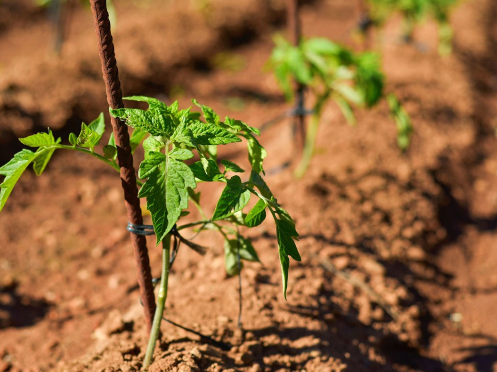

1. Concimazione del terreno:
   * Rover
2. Semina del pomodoro:
   * Rover
3. Spaziatura delle piante:
   * Rove
   
4. Piantare le piantine:
   * Non necessaria
5. Costruire i sostegni e legare il pomodoro:
   * Manuale
6. Irrigazione:
   * Automatico con sensore di umiditá del suolo. 
   
7. Raccolta:
   * Manuale
8. Spargere medicinali:
   * Valvola Automatica Sprinkler. 
   

Cose difficili:
* Estirpare erbacce
* Riconoscere malattie
* Raccogliere pomodori
* Rilevare insetti
